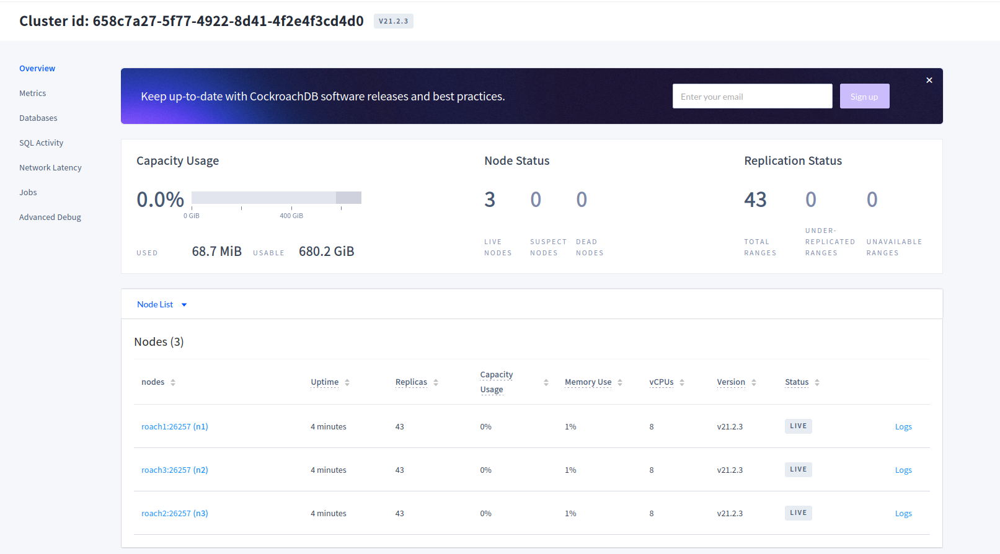

# NewSQL database with CockroachDB

In this tutorial, we use CockroachDB as a technology choice for NewSQL databases: to test scalable SQL database systems for big data.

You can read the following papers/links to see how CockroachDB (and NewSQL databases) could help to serve the big data scenarios:
- [CockroachDB: The Resilient Geo-Distributed SQL Database](https://dl.acm.org/doi/10.1145/3318464.3386134)
- [What's Really New with NewSQL?](https://dl.acm.org/doi/10.1145/3003665.3003674)

## Setup a cluster of CockroachDB

CockroadDB provides [detailed information for installing a cluster for testing](https://www.cockroachlabs.com/docs/stable/install-cockroachdb-linux.html). You can find the instructions and follow them.

We provide here a simple [docker compose file](cockroachdb-compose.yml) for setting up 3 nodes based on [how to setup CockroachDB using Docker](https://www.cockroachlabs.com/docs/stable/start-a-local-cluster-in-docker-mac.html).

>Make sure you revise and correct the docker compose file for your environment. For example, you can change the directory **/tmp/cse4640/roach*** for storing data or the ports.

Start a cluster in a terminal:

```
$docker-compose -f cockroachdb-compose.yml up
```
You see the output like:
```
roach3_1  | * WARNING: The server appears to be unable to contact the other nodes in the cluster. Please try:
roach3_1  | *
roach3_1  | * - starting the other nodes, if you haven't already;
roach3_1  | * - double-checking that the '--join' and '--listen'/'--advertise' flags are set up correctly;
roach3_1  | * - running the 'cockroach init' command if you are trying to initialize a new cluster.
roach3_1  | *
roach3_1  | * If problems persist, please see https://www.cockroachlabs.com/docs/v21.2/cluster-setup-troubleshooting.html.

```

Now open another terminal and use **docker ps** you can see a list of containers, e.g.

```
truong@aaltosea:~/myprojects/mygit/cs-e4640/tutorials/newsqldb$ docker ps
CONTAINER ID   IMAGE                           COMMAND                  CREATED         STATUS         PORTS                                                                                      NAMES
5c1cb5a7a829   cockroachdb/cockroach:v21.2.3   "/cockroach/cockroac…"   3 minutes ago   Up 3 minutes   8080/tcp, 26257/tcp                                                                        newsqldb_roach3_1
fb5bcb3a9e6c   cockroachdb/cockroach:v21.2.3   "/cockroach/cockroac…"   3 minutes ago   Up 3 minutes   8080/tcp, 26257/tcp                                                                        newsqldb_roach2_1
2bb1b8fad755   cockroachdb/cockroach:v21.2.3   "/cockroach/cockroac…"   3 minutes ago   Up 3 minutes   0.0.0.0:8080->8080/tcp, :::8080->8080/tcp, 0.0.0.0:26257->26257/tcp, :::26257->26257/tcp   newsqldb_roach1_1
```
>Note: docker compose creates the name based on specified names and other information like project/directory.

Now you see the names of the containers. Then you can initialize a cluster (do this only for the one time):

```
$docker exec -it newsqldb_roach1_1 ./cockroach init --insecure
```

Go back to the terminal where you run docker-compose you might see:

```
roach3_1  | CockroachDB node starting at 2022-01-23 12:25:32.68133592 +0000 UTC (took 418.3s)
roach3_1  | build:               CCL v21.2.3 @ 2021/12/14 15:23:22 (go1.16.6)
roach3_1  | webui:               http://roach3:8080
roach3_1  | sql:                 postgresql://root@roach3:26257/defaultdb?sslmode=disable
roach3_1  | sql (JDBC):          jdbc:postgresql://roach3:26257/defaultdb?sslmode=disable&user=root
roach3_1  | RPC client flags:    /cockroach/cockroach <client cmd> --host=roach3:26257 --insecure
roach3_1  | logs:                /cockroach/cockroach-data/logs
roach3_1  | temp dir:            /cockroach/cockroach-data/cockroach-temp035669399
roach3_1  | external I/O path:   /cockroach/cockroach-data/extern
roach3_1  | store[0]:            path=/cockroach/cockroach-data
roach3_1  | storage engine:      pebble
roach3_1  | status:              initialized new node, joined pre-existing cluster
roach3_1  | clusterID:           658c7a27-5f77-4922-8d41-4f2e4f3cd4d0
roach3_1  | nodeID:              2
roach2_1  | CockroachDB node starting at 2022-01-23 12:25:32.709819103 +0000 UTC (took 419.4s)
roach2_1  | build:               CCL v21.2.3 @ 2021/12/14 15:23:22 (go1.16.6)
roach2_1  | webui:               http://roach2:8080
roach2_1  | sql:                 postgresql://root@roach2:26257/defaultdb?sslmode=disable
roach2_1  | sql (JDBC):          jdbc:postgresql://roach2:26257/defaultdb?sslmode=disable&user=root
roach2_1  | RPC client flags:    /cockroach/cockroach <client cmd> --host=roach2:26257 --insecure

```
**The cluster is UP** you can start to use it. For example, login into a node and run an sql shell:

```
$docker exec -it newsqldb_roach1_1 ./cockroach sql --insecure
```

Or check: the UI at https://localhost:8080 to see something like


>You can follow start/stop the cluster and other nodes. Take a look at the guide in the CockroachDB website.

## Practices with data ingestion, queries, and performance tests

- Check [some existing datasets from our links and select a suitable dataset for tests](../../data/README.md)
- Create database schemas
  - As an example we have [a simple schema based on COVID 19 Open Data from Google Big Query](sampleschema.sql)
- Create databases, e.g., using sql shell. The way is very much similar to other SQL databases.
- Use available libraries and write code to ingest data.
>Check: https://www.cockroachlabs.com/docs/v21.2/install-client-drivers.html for examples for libraries.

## Using a free CockroachDB

You can also try to use a free [CockroachDB Serverles](https://www.cockroachlabs.com/pricing/). In this case, you mainly play as a user to insert and query data.

