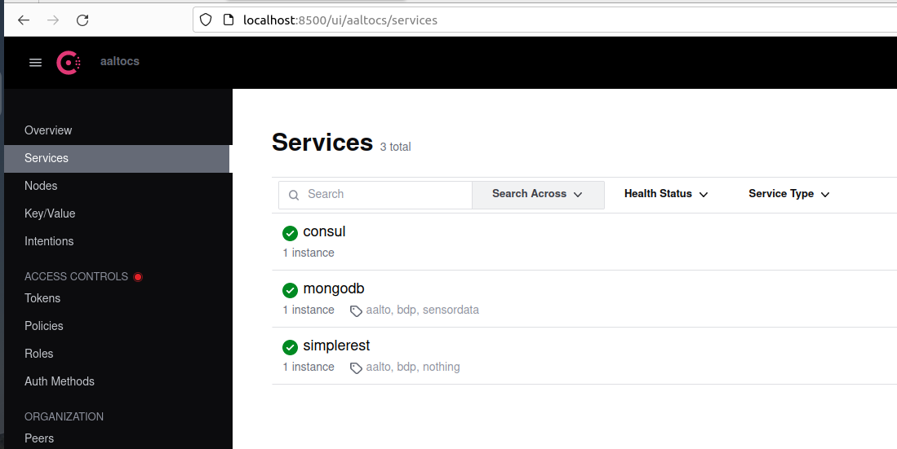
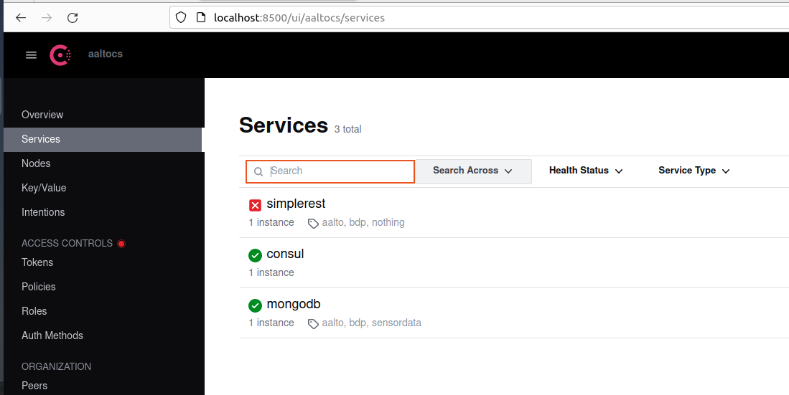

# A simple guideline for exercising service discovery

## Consul

We use [consul](https://www.consul.io/) for service discovery.
>You can also use ZooKeeper and etcd to study. But then you need to adapt the code for them

## Practices

> change the code to fix it into your setting, especially, we have some specific paths/urls in the code

### Running consul

* Make sure that you have consul installed in your machine.
* using consul-server.sh to run a consul server for testing
```
$bash consul-server.sh aaltocs aaltosea /tmp/consul 0.0.0.0
```
Meaning that we run a consul server with:
* -datacenter=aaltocs: to indicate the data center
* -node=aaltosea: to indicate the name of the agent
* -data-dir=/tmp/consul: to indicate the place where the data is stored
* -bind=0.0.0.0: to indicate the network interface for the internal cluster communication
  
You should see consul running: for example check http://localhost:8500/ 

### Run some services

Assume that you have some services that you need to discover. You can run  some mockup services:
```
  $node ../dms/simple_rest.js
  $docker run -p 27017:27017 mongo:latest
```
Assume that the simple_rest is running with PORT=3000, you can check the simple_rest by
```
$curl -X GET http://localhost:3000/self
$curl -X GET http://localhost:3000/health
```

### Publishing and discovering service information

In principle, services will publish their information into consul. We just make some simple example:

* test the publishing service information:
  -using the program simple_registry.js and simple service descriptions to publish the service information. Make sure you update the json to fit into your service

  ```
  $node simple_register.js mongoservice.json
  $node simple_register.js ../dms/simple_rest.json
  ```
  the simple_rest.json can be obtained by calling simple_rest **curl -X GET http://localhost:3000/self**.

* check your consul service, e.g., using http://localhost:8500/ui to see if services are alive or not

You should see consul running: for example check http://localhost:8500/


* start and stop simple_rest.js and mongodb container and then go to the consul UI to see if the services are alive or not

