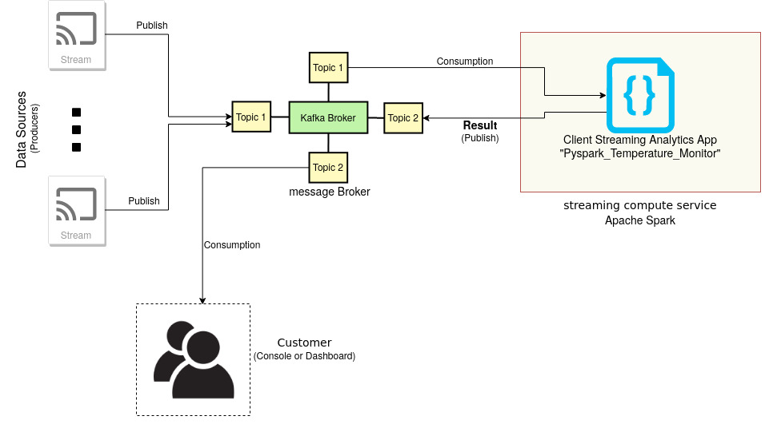

# Tutorial: Streaming Analytics with Apache Spark

This tutorial deals with performing streaming analytics using Apache spark. We attempt to model a real-world workflow where streaming data is coming from message broker and the stream processing engine ingests the messages. The result is then feedback on the same message broker.

* [An acommpanying hands-on video is available](https://aalto.cloud.panopto.eu/Panopto/Pages/Viewer.aspx?id=ab115ae1-0d37-435e-8587-abe600d04d6a)
* [Slides](slide/cs-e4640-hands-on-sparks-streaming.pptx)

### Prerequisite knowledge:
- docker and docker-compose
- Basic idea about message brokers and Apache Kafka
- Basic information about stream processing and Apache Spark Streaming

The tutorial uses python for writing custom components.

### Python dependencies:
The following two were the python dependencies:
- kafka-python==2.0.1
- pyspark

Additionally, the `spark-submit` application requires the `kafka-connector` jar file. We are using `org.apache.spark:spark-streaming-kafka-0-8-assembly_2.11:2.4.6` jar in this  tutorial.

### About the stream processing

* Windowing: We are using a fixed size tumbling window. Since, we are developing a temperature sensor aggregator, our stream analytics application will run at a fixed interval (i.e. one minute). There can be different alerting mechanisms depending on missing or anomalous data.

* Time used: Event Time is being used in this case i.e. the time at which the incident took place should be associated with the stream sources. The analytics for our dataset is basically driven with the time-series temperature data.

### Workflow

---

* Fig 1: Workflow/Architecture of the application
---

* Message Broker: The message broker is `Kafka`. Kafka provides partitioned message stream broker and due to its scalability, it makes perfect choice for integration with stream processing applications. The variant of Kafka used was [wurstmeister/Kafka-docker](https://github.com/wurstmeister/kafka-docker/). We are using a scaled variant of Kafka-docker with multiple brokers and zookeeper service discovery. However, this tutorial can be run in simple mode too.

* Streaming computing service: This service runs Apache Spark Streaming and serves as the platform for running client streaming analytics application. It also aids in consumption of incoming stream data. This demo shows multiple scaled up spark worker nodes.

* Customer streaming analytics app: This application is responsible for consuming stream data, performing streaming analytics on a fixed window and then publish the result. It does the consumption on same kafka topics that the consumer is producing on. It publishes the stream results on a different topic that clients can ingest onto. Additionally it may also connect to a temporary database like Redis for performing stateful streaming analysis (Out of scope for this tutorial).

* Consumer dashboard is just a kafka-consumer written in python that listens on the result.


`customerstreamapp` is developed on python using the `pySpark` package for spark on python.  It collates all the streaming result into a RDD which is processed on a fixed tumbling window interval. All of the spark streaming functions and methods work on a RDD. The Kafka messages are deserialized by `org.apache.kafka.common.serialization.StringDeserializer` package. This jar file for this package is submitted as dependency to spark jobs while running pyspark.

### Implementation

#### 1. Start the apache kafka

To start Kakfa, first run zookeeper:

```bash
$ docker-compose up -d zookeeper
```

Next start the Kafka brokers by:
```bash
$ docker-compose up --scale kafka=1
```

the relevant docker-compose service looks like:

```yaml
  zookeeper:
    image: wurstmeister/zookeeper
    ports:
      - "2181"
  kafka:
    image: wurstmeister/kafka
    ports:
      - "9092"
    environment:
      KAFKA_ADVERTISED_HOST_NAME: 192.168.0.1
      KAFKA_ZOOKEEPER_CONNECT: zookeeper:2181
    volumes:
      - /var/run/docker.sock:/var/run/docker.sock
```

The kafka port number can be checked using `docker-compose ps` command.

#### 2. Kafka Producer
Next, start the Kafka producer. A sample Kafka producer can be found here: https://github.com/rohitshubham/edge_simulator/blob/master/mini-batch-converter/cloud_publisher.py

The publisher should start producing messages at certain intervals.

#### 3. Start Spark Main Node:

To start the spark main node, use the following command:

```bash
$ docker-compose up -d spark
```

The spark service looks like:
```yaml
  spark:
    image: bitnami/spark:latest
    environment:
      - SPARK_MODE=master
    expose:
      - "7077"
    ports:
      - '8080:8080'
```

It will allow worker nodes to connect on port `7077`. This will also expose the Web UI on port `8080`

#### 4. Start multiple worker nodes:

To start multiple worker nodes, use the following command:

```bash
$ docker-compose scale spark-workers=2
```

The spark worker service looks like :
```yaml
  spark-worker:
    image: bitnami/spark:latest
    depends_on:
      - spark
    environment:
      - SPARK_MODE=worker
      - SPARK_MASTER_URL=spark://spark:7077
      - SPARK_WORKER_MEMORY=1G
      - SPARK_WORKER_CORES=1
```

#### 5. Start client ingestion application

Finally, start the client ingestion application. This ingestion application can be either dockerized or standalone. Our example uses a custom dockerized spark streaming application from here: https://github.com/rohitshubham/Cloud-pipeline/tree/master/SparkProcessor

The entry point is `start-spark.sh` that submits the job as:

```bash
$ spark-submit --master "spark://spark:7077" --packages  org.apache.spark:spark-streaming-kafka-0-8-assembly_2.11:2.4.6 pyspark_processor.py
```

#### 6. Consumer dashboard

To listen on the results, start the application to connect to the Kafka broker on the topic `report`. Asn example is at
https://github.com/rohitshubham/Cloud-pipeline/blob/master/Util/client-report.py

It can be launched as :
```bash
$ python3 client-report.py "192.168.0.1:38282" report
```

### Things to remember:
* We must take care of Kafka Consumer groups and perform offset management to ensure that messages are being delivered correctly.
* We might have to perform json deserialization on the received messages before attempting to process the RDD.
* We can also use `msgpack` to improve the performance of message bytes while sending data over Kafka broker.


---
This tutorial is meant to serve as a definitive guide and not a step-by-step walkthrough and hence, the steps might slightly differ depending on the system and development environment.
